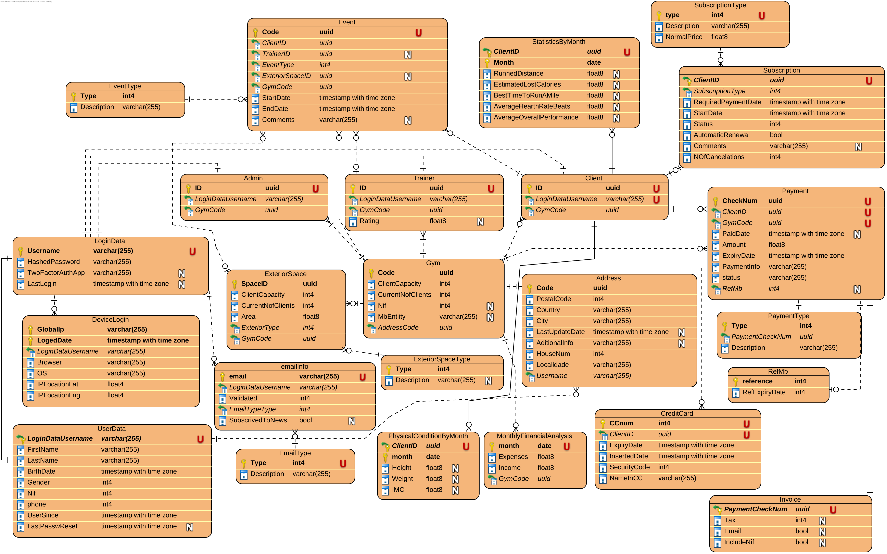

# Projeto 2 ano!

# Ginásio académico.

## Autores:
[Diogo Bernardo](https://www.github.com/Db-Dev2002) a21144@alunos.ipca.pt

[João Ribeiro](https://github.com/joaaribeiro04) a23795@alunos.ipca.pt

## Smart Campus -- Ipca Gym

## License

Licensed under either of

 * Apache License, Version 2.0
   **([LICENSE-APACHE](LICENSE-APACHE)** available at http://www.apache.org/licenses/LICENSE-2.0)
 * MIT license
   **([LICENSE-MIT](LICENSE-MIT)** available at http://opensource.org/licenses/MIT)

at your option.

## Contribution

Unless you explicitly state otherwise, any contribution intentionally submitted
for inclusion in the work by you, as defined in the Apache-2.0 license, shall be
dual licensed as above, without any additional terms or conditions.
